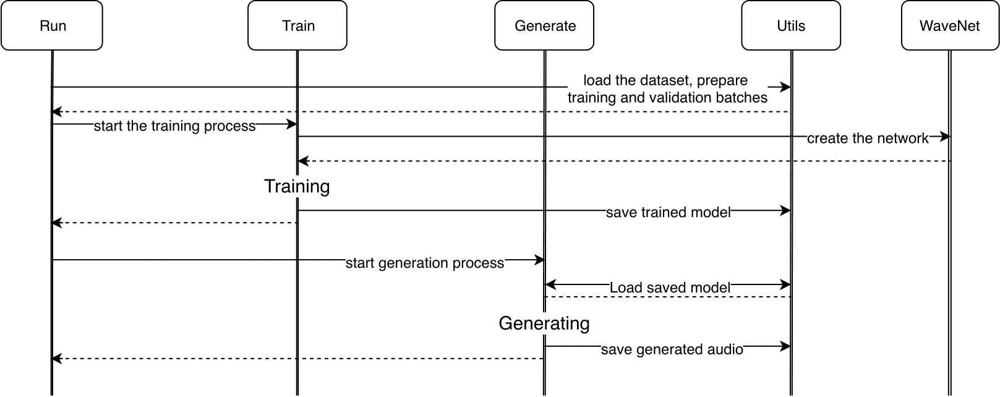

# WaveNet for music generation
[WaveNet](https://arxiv.org/abs/1609.03499) is a generative model for raw audio waveforms, introduced by van den Oord et al in 2016, that has since found many applications in multiple domains. The purpose of this repo is to form a codebase that would use wavenet to generate music. A lot of WaveNet's architecture was repurposed from [ibab's implementation](https://wis.fit.vutbr.cz/FIT/st/rp.php/rp/2017/BP/20864.pdf), as well as [fast-wavenet](https://github.com/tomlepaine/fast-wavenet), kudos to them.

## How to use
Prerequisites:
  - python3 and possibility of installing additional packages (Miniconda/Anaconda/virtualenv can be helpful).
Install all the necessary packages by running `pip install -r requirements.txt`

Training and generating
  - Configure the run with `parameters.json` and run `python3 run.py`

Generating only:
  - I included one pre-trained model for generating only, no GPU required: Configure the `model` attribute in `parameters.json` to be 'example_model/saved_weights/' and run `python3 run.py --train=False`.

## Structure
- run.py -> entry point of the program, handles arguments, invokes all the actions
- train.py -> class Train involving training operations
- wavenet.py -> class Net representing the WaveNet model
- generate.py -> class Generate representing the Generator
- utils.py -> all the other useful utilities, such as plotting, logging and timestamp creation

## Process
- Preprocessing phase: Audio is read by librosa with a chosen sample rate and reshaped to [-1, 1]. It is then quantized to --n_channels (256 by default) quantization channels to create the inputs and targets used as training data.
- Training phase: Repurposed from [tensorflow-wavenet](https://github.com/ibab/tensorflow-wavenet). Model is created as a stack of dilated causal convolution layers, AdamOptimizer is created to be used for training. Training stops after reaching completing desired number of epochs. Training can be skipped altogether assuming --model= argument is supplied with directory containing saved weights of a model that should be restored for generation.
- Generation phase: Repurposed from [fast-wavenet](https://arxiv.org/pdf/1611.09482.pdf) - caching is used to avoid recomputing outputs for every generated sample. After being supplied with the first sample the generation model predict every next sample from the previous one using distributions of conditional probabilities.

State transition diagram of the process:

## Data
These datasets were tested:
- [vctk corpus](http://homepages.inf.ed.ac.uk/jyamagis/page3/page58/page58.html)
- [YT-8M](https://research.google.com/youtube8m/)
- [MagnaTagATune](http://mirg.city.ac.uk/codeapps/the-magnatagatune-dataset)
- [Irmas](http://mirg.city.ac.uk/codeapps/the-magnatagatune-dataset)

## Output
The output directory storing training and generation results is dictated by `output_dir` attribute in `parameters.json` if set, otherwise a directory identified by a timestamp is created at the root level.

Check out the published thesis [here](https://wis.fit.vutbr.cz/FIT/st/rp.php/rp/2017/BP/20864.pdf).
